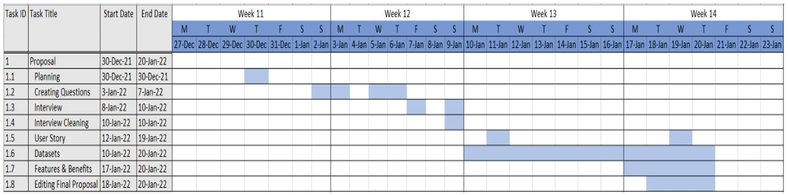
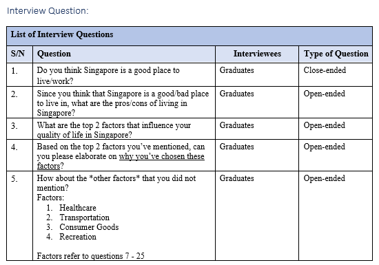
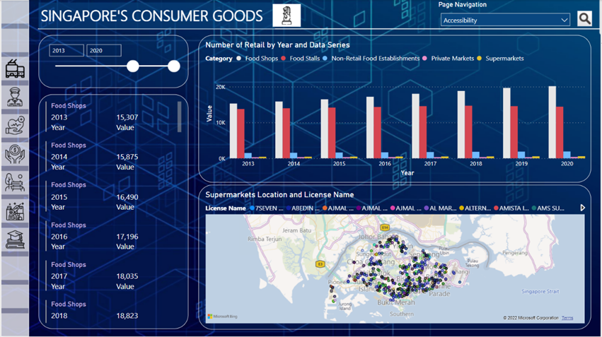

# Visual-Analytic-Project---NYP

**Project Title**: Visual Analytic Project 
**Date Completed**: 28-02-2022 
**Team Members**: Shermaine, Andrew, Shi Min, Zhang Xiang 
theme: THEME-NAME

## Tasks

1. Gather user requirements from key stakeholders with different cultural backgrounds and diverse needs using effective communication and interpersonal skills.
2. Use user story approach to capture user requirements and functionalities of the required system using online collaboration tools to establish acceptance criteria and business problems.
3. Perform data exploratory analysis and prepare data for visualisation presentation using ETL techniques.
4. Analyse business problems using statistical modelling techniques to support decision-making.
5. Work collaboratively in teams to develop real‐time visualisations for effective communication on business insights to the key stakeholders

## Project Background & Scope

According to a popular website on the topic of living and working in Singapore1, it reported that the quality of life is often used as a shorthand for measuring how good one feels about one’s life. There are formal procedures for calculating this measure that includes factors such as economic, social, physical, political, and spiritual well-being. Singapore may be the smallest country in Southeast Asia, but it has emerged as one of the best places to live in Asia with a very high quality of life measurement.

Singapore has been ranked as the top city in Asia in terms of quality of living according to global human resource consultancy, Mercer. Singapore is also regarded as the ‘Happiest country in Southeast Asia’ according to the 2018 World Happiness Report2.

**Hypothesis Statement: Based on the report, it seems that Singapore is a good place to live / work in. Is this true?**

## Planning

**Common factors selected are:**
- Economic
- Consumer Goods
- Healthcare
- Security
- Education
- Transportation

### Planning Stage

### User Requirements
The overview of our stakeholder consists of three females and four males, aged between 16 and 19, all of whom are Singaporeans. Among them are unemployed fresh graduates, students, and national service members. Their highest education level achieved is either an O-Level Certificate or a diploma in their relevant courses.

### Interview Questions (Example)

### Gathered Responses and Benefits + Possible Datasets

## Perform ETL - Microsoft SQL server & Power BI

### Data Understanding

Understanding and determining right dataset was completed at the step below:

### Data Transformation

Cleaning and Transformation in data was completed at the step below:

## Visualisation - Power BI
Process taken while developing visuals

### Visual Sample:

## Integrated Power BI

## Conclusion

In conclusion, all the factors mentioned show that Singapore is doing its best in making Singapore a better place to live in, such as the efforts they have put in to ensure smoother public transportation and a safer environment for citizens. In addition, they also put much effort into reducing the price of local goods and ensuring quality education is open to all citizens. Also, with the many facilities provided and increased spending each year, Singapore has proved to have put much effort into ensuring high-quality healthcare. Furthermore, they provide many job opportunities to aid citizens with retrenchment. Lastly, Singapore has been ensuring affordability and accessibility for all citizens in Singapore regardless of the factor.
Therefore, we feel that the outcome of our analysis fits with our project expectation and agrees with the hypothesis.
