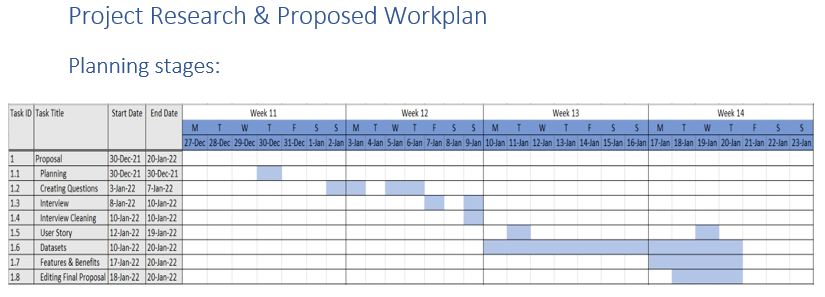

# Visual-Analytic-Project---NYP

**Project Title**: Visual Analytic Project 
**Date Completed**: 30-02-2022 
**Team Members**: Shermaine, Andrew, Shi Min, Zhang Xiang 

## Task

1. Gather user requirements from key stakeholders with different cultural backgrounds and diverse needs using effective communication and interpersonal skills.
2. Use user story approach to capture user requirements and functionalities of the required system using online collaboration tools to establish acceptance criteria and business problems.
3. Perform data exploratory analysis and prepare data for visualisation presentation using ETL techniques.
4. Analyse business problems using statistical modelling techniques to support decision-making.
5. Work collaboratively in teams to develop real‐time visualisations for effective communication on business insights to the key stakeholders

## Project Background & Scope
According to a popular website on the topic of living and working in Singapore1, it reported that the quality of life is often used as a shorthand for measuring how good one feels about one’s life. There are formal procedures for calculating this measure that includes factors such as economic, social, physical, political, and spiritual well-being. Singapore may be the smallest country in Southeast Asia, but it has emerged as one of the best places to live in Asia with a very high quality of life measurement.
Singapore has been ranked as the top city in Asia in terms of quality of living according to global human resource consultancy, Mercer. Singapore is also regarded as the ‘Happiest country in Southeast Asia’ according to the 2018 World Happiness Report2.

**Hypothesis Statement: Based on the report, it seems that Singapore is a good place to live / work in. Is this true?**

## Planning

### User Requirements
The overview of our stakeholder consists of three females and four males, aged between 16 and 19, all of whom are Singaporeans. Among them are unemployed fresh graduates, students, and national service members. Their highest education level achieved is either an O-Level Certificate or a diploma in their relevant courses.

## Data Understanding

## Data Cleaning

## Visualisation

## Integration

## Execution
